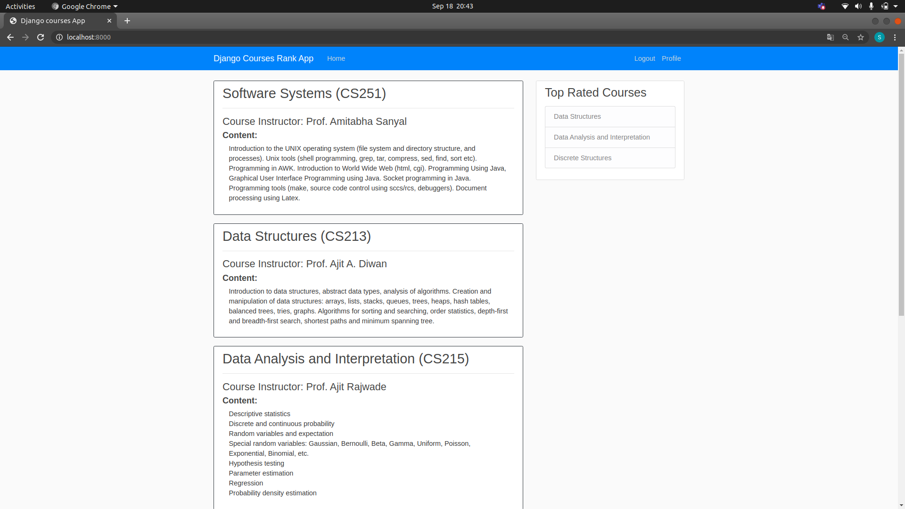
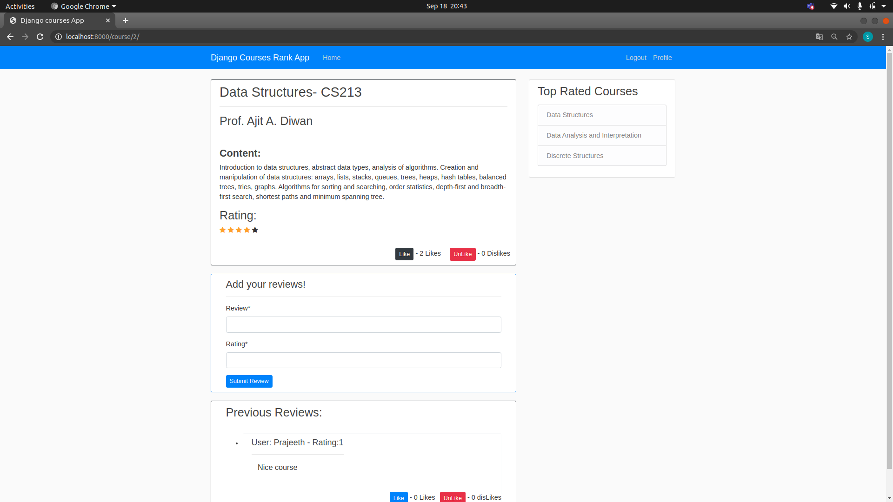

# django-courserank - https://github.com/girish-srivatsa/django-courserank #
--------------------------------------------------------

This is a basic Courses-Rank App developed using the django framework. 

## Features : ##
* It contains courses taught at IITB with ratings. 
* Users can create accounts and add profile pics, and also update their info.
* They are given the ability to view courses and like or dislike them.
* Also, they are allowed to write reviews for courses and rate them. 
* Users can also like or dislike reviews written by them and other users as well.
* It has been deployed into Heroku as []{courserank.herokuapp.com}

## Some pictures of the app: ##

